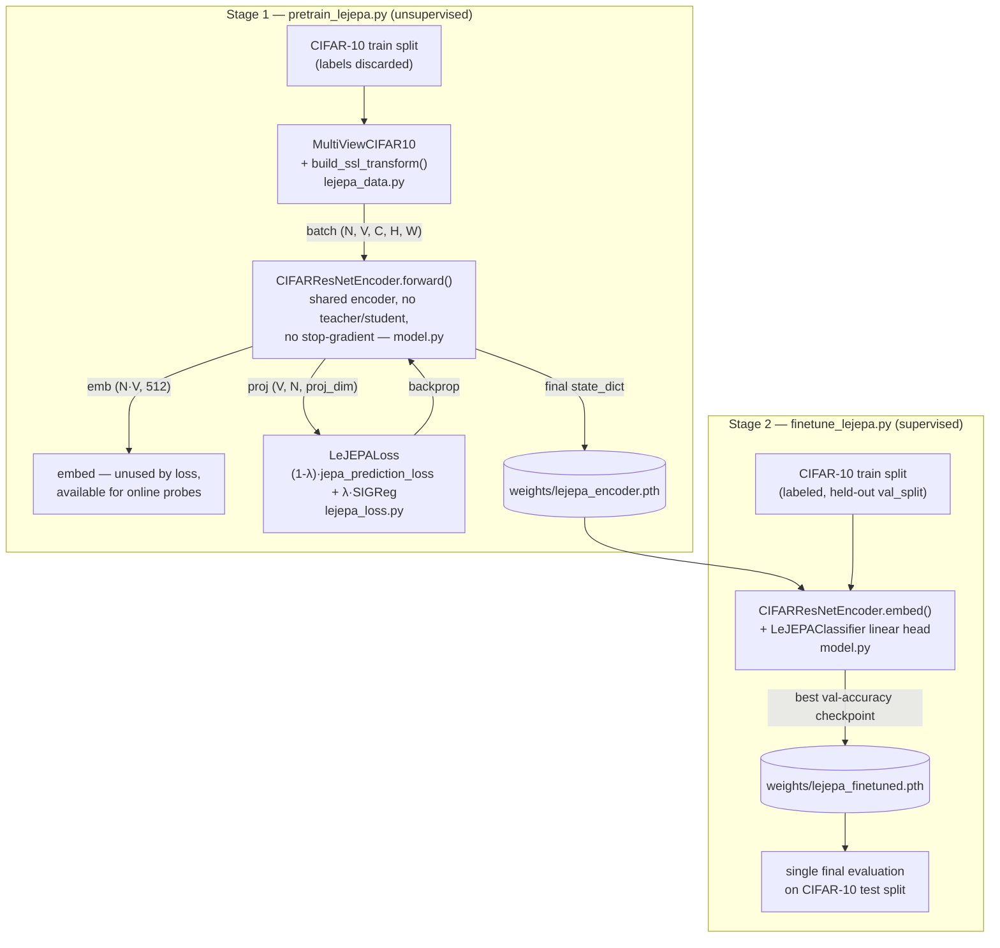

# InMindCNN

CIFAR-10 image classification in PyTorch: a LeJEPA self-supervised
pretraining + fine-tuning pipeline, sharing `config.yaml`, `data/`, and
`weights/` across both stages.

## Repo structure

```
.
├── config.yaml                       # hyperparameters + paths shared by both stages (lejepa:, paths:)
├── lejepa_data.py                    # MultiViewCIFAR10 dataset + SSL augmentation transform
├── model.py                          # BasicBlock, CIFARResNetEncoder, LeJEPAClassifier
├── lejepa_loss.py                    # LeJEPALoss = jepa_prediction_loss + SIGReg
├── pretrain_lejepa.py                # stage 1 entry point: self-supervised pretraining loop
├── finetune_lejepa.py                # stage 2 entry point: supervised fine-tuning + test eval
├── run_lejepa_pipeline.sh            # runs pretrain_lejepa.py -> finetune_lejepa.py back-to-back
├── tests/
│   ├── test_lejepa_data.py
│   └── test_lejepa_loss.py
├── lejepa.pdf                        # reference paper PDF (local reference material)
├── data/                             # CIFAR-10, auto-downloaded on first run (gitignored)
└── weights/                          # checkpoints written by pretrain/finetune (gitignored)
```

## Quickstart

1. **Clone the repository:**
   ```bash
   git clone <repo-url>
   cd inmindCNN
   ```

2. **Install the uv Python package manager (faster than pip):**
   ```bash
   pip install uv
   ```

3. **Install all dependencies defined in `pyproject.toml`:**
   ```bash
   uv sync
   ```

4. **Edit `config.yaml`** for hyperparameters and paths if needed.
   - `val_split` controls the fraction of training data used for validation (default: 0.1).

5. **Run the LeJEPA pipeline** (see below).

## LeJEPA: self-supervised pretraining + fine-tuning

Pretrain a CIFAR-style ResNet-18 encoder unsupervised on multi-view
augmentations (no labels, no negative pairs), then fine-tune a
classifier head on top of it. Hyperparameters for both stages live
under the `lejepa:` block in `config.yaml`.

1. **Pretrain the encoder:**
   ```bash
   uv run pretrain_lejepa.py
   ```
   - Trains on CIFAR-10's train split only, with labels discarded.
   - Saves the final encoder to `weights/lejepa_encoder.pth`.
   - Resumable: saves a mid-run checkpoint after every epoch to
     `weights/lejepa_pretrain_resume.pth`, and auto-resumes from it on
     restart, so a crash/disconnect loses at most one epoch.

2. **Fine-tune a classifier on the pretrained encoder:**
   ```bash
   uv run finetune_lejepa.py
   ```
   - Loads `weights/lejepa_encoder.pth`, attaches a linear classifier
     head, and trains/validates on CIFAR-10's train split (held-out
     `val_split`) before evaluating once on the test set.
   - Saves the best-by-validation-accuracy checkpoint to
     `weights/lejepa_finetuned.pth`.

3. **Or run both stages back-to-back:**
   ```bash
   ./run_lejepa_pipeline.sh
   ```
   Stops on the first failure so a broken pretrain run doesn't silently
   feed a fine-tuning stage.

### Architecture



- **Stage 1** trains the encoder with no labels: every view of every
  image goes through the same shared encoder, and the loss alone
  (prediction term + isotropic-Gaussian SIGReg regularizer) keeps the
  embeddings from collapsing; no negative pairs, no momentum encoder.
- **Stage 2** loads that encoder, discards the SSL projector, and
  attaches a linear classifier on top of `embed()`'s 512-dim output for
  ordinary supervised training/evaluation.


## Validation
- A portion of the training set is used for validation (see `val_split` in config).
- After each epoch, validation loss and accuracy are printed.
- Final test loss and accuracy are printed after training.

## Testing
Run the test suite with:
```bash
uv run pytest
``` 

### References

LeJEPA: Provable and Scalable Self-Supervised Learning Without the Heuristics, https://arxiv.org/abs/2511.08544 
