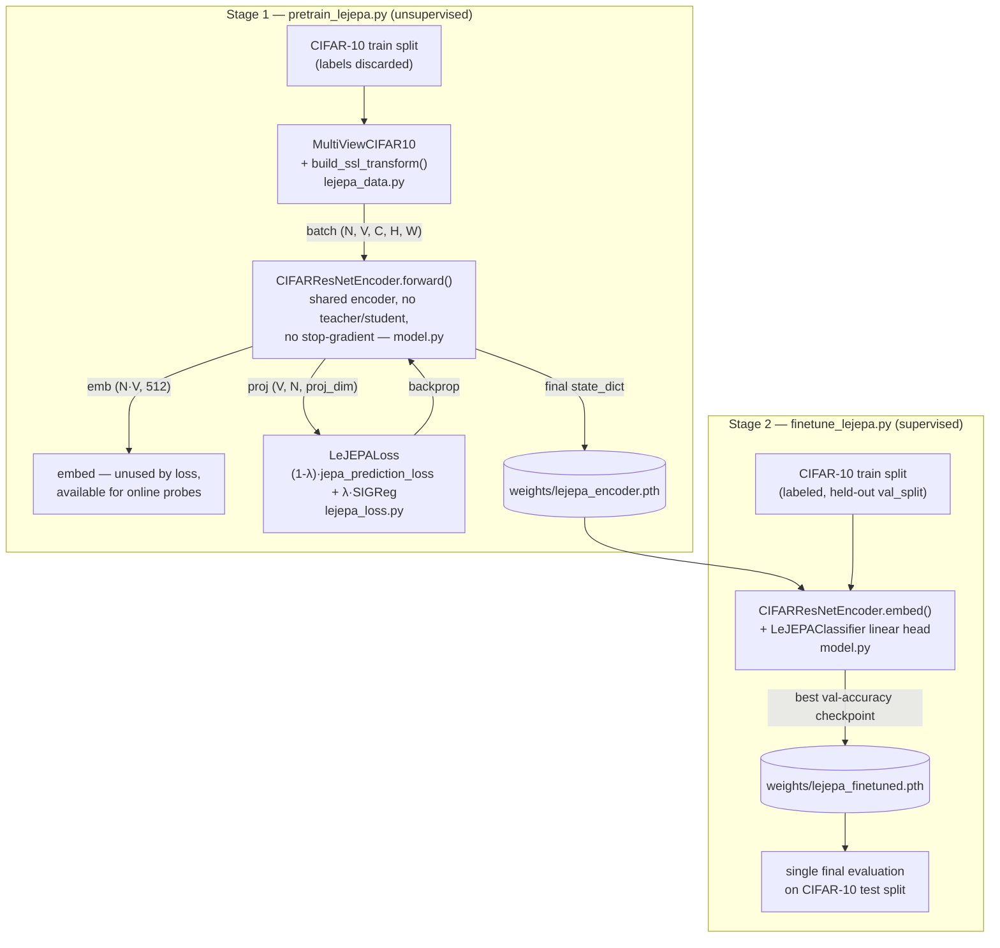
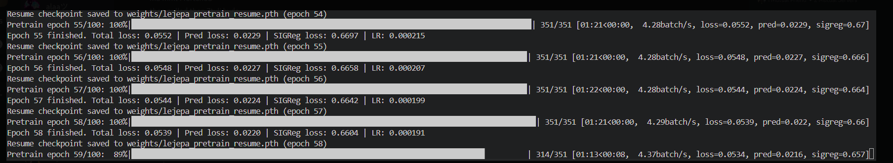
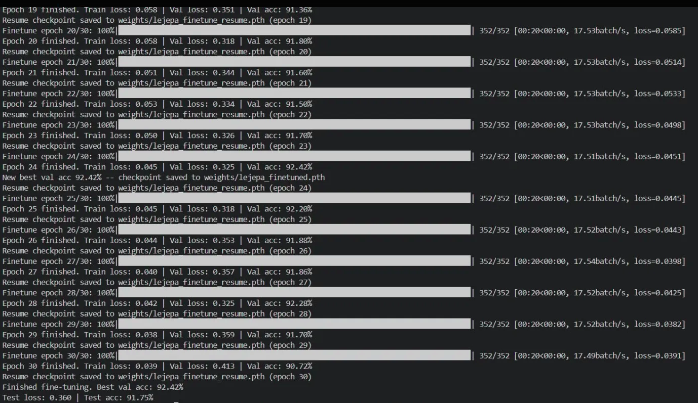
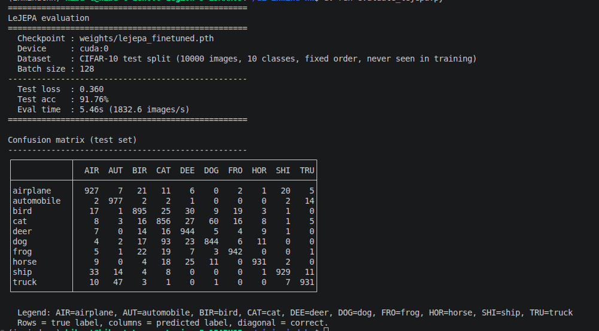
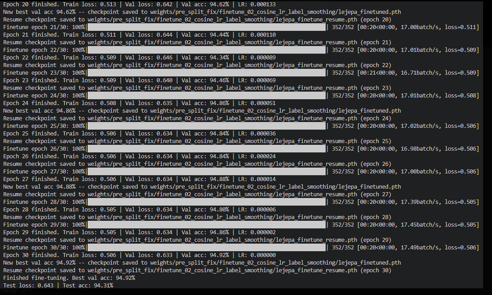
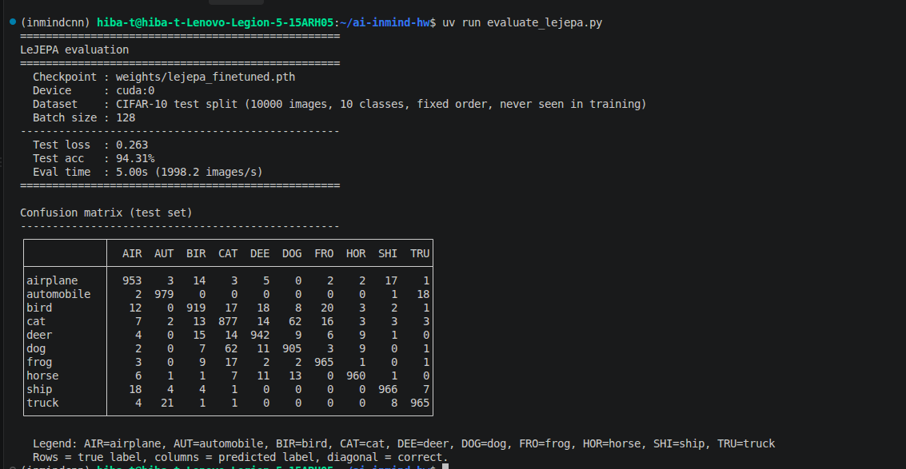
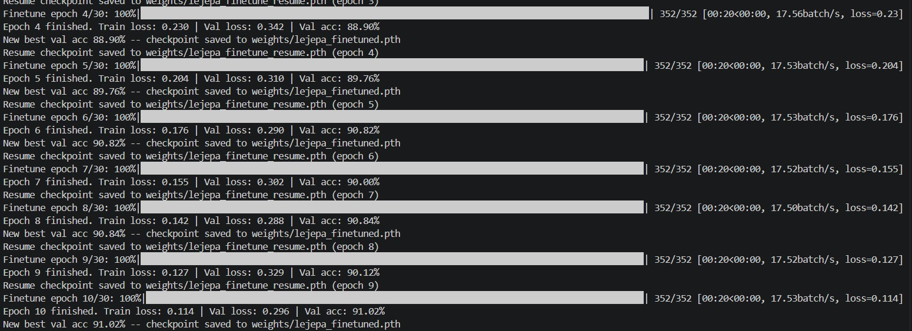
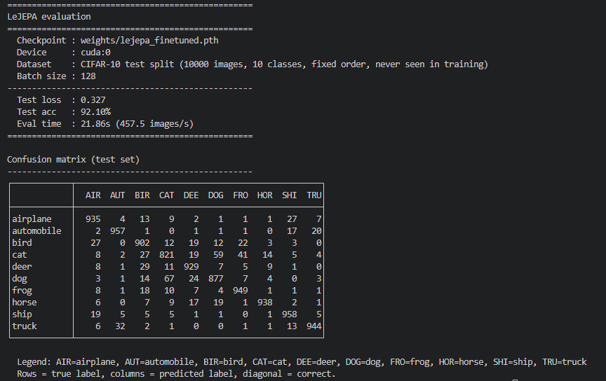

# InMindCNN

CIFAR-10 image classification in PyTorch: a LeJEPA self-supervised pretraining + fine-tuning pipeline, sharing `config.yaml`, `data/`, and `weights/` across both stages.

## Repo structure

```
.
├── config.yaml                       # hyperparameters + paths shared by both stages (lejepa:, paths:)
├── lejepa_data.py                    # MultiViewCIFAR10 dataset + SSL augmentation transform
├── model.py                          # BasicBlock, CIFARResNetEncoder, LeJEPAClassifier
├── lejepa_loss.py                    # LeJEPALoss = jepa_prediction_loss + SIGReg
├── pretrain_lejepa.py                # stage 1 entry point: self-supervised pretraining loop
├── finetune_lejepa.py                # stage 2 entry point: supervised fine-tuning + test eval
├── evaluate_lejepa.py                # standalone test-set eval of a fine-tuned checkpoint + confusion matrix
├── run_lejepa_pipeline.sh            # runs pretrain_lejepa.py -> finetune_lejepa.py back-to-back
├── tests/
│   ├── test_lejepa_data.py
│   └── test_lejepa_loss.py
├── data/                             # CIFAR-10, auto-downloaded on first run (gitignored)
└── weights/                          # checkpoints written by pretrain/finetune/evaluate (gitignored)
    ├── lejepa_encoder.pth                # final SSL-pretrained encoder (stage 1 output)
    ├── lejepa_pretrain_resume.pth        # mid-run resumable checkpoint for pretraining
    ├── lejepa_finetuned.pth              # best-by-val-accuracy classifier checkpoint (stage 2 output)
    └── lejepa_finetune_resume.pth        # mid-run resumable checkpoint for fine-tuning
```

## Dataset

[CIFAR-10](https://www.cs.toronto.edu/~kriz/cifar.html): 60,000 32x32x3 RGB images (32x32 pixels, 3 color channels) across 10 classes (`airplane`, `automobile`, `bird`, `cat`, `deer`,`dog`, `frog`, `horse`, `ship`, `truck`), 6,000 images per class where 50,000 for training, 10,000 for test. Auto-downloaded into `data/` on first run.
LeJEPA pretraining uses the train split only (labels discarded); fine-tuning uses the train split (with a held-out `val_split` for validation) and evaluates once on the test split.

## Quickstart

1. **Clone the repository:**
   ```bash
   git clone <repo-url>
   cd inmindCNN
   ```

2. **Install the uv Python package manager (faster than pip):**
   ```bash
   pip install uv
   ```

3. **Install all dependencies defined in `pyproject.toml`:**
   ```bash
   uv sync
   ```

4. **Edit `config.yaml`** for hyperparameters and paths if needed.
   - `val_split` controls the fraction of training data used for validation (default: 0.1).

5. **Run the LeJEPA pipeline** (see below).

## LeJEPA: self-supervised pretraining + fine-tuning

Pretrain a CIFAR-style ResNet-18 encoder unsupervised on multi-view
augmentations (no labels, no negative pairs), then fine-tune a
classifier head on top of it. Hyperparameters for both stages live
under the `lejepa:` block in `config.yaml`.

1. **Pretrain the encoder:**
   ```bash
   uv run pretrain_lejepa.py
   ```
   - Trains on CIFAR-10's train split only, with labels discarded.
   - Saves the final encoder to `weights/lejepa_encoder.pth`.
   - Resumable: saves a mid-run checkpoint after every epoch to
     `weights/lejepa_pretrain_resume.pth`, and auto-resumes from it on
     restart, so a crash/disconnect loses at most one epoch.

2. **Fine-tune a classifier on the pretrained encoder:**
   ```bash
   uv run finetune_lejepa.py
   ```
   - Loads `weights/lejepa_encoder.pth`, attaches a linear classifier
     head, and trains/validates on CIFAR-10's train split (held-out
     `val_split`) before evaluating once on the test set.
   - Saves the best-by-validation-accuracy checkpoint to
     `weights/lejepa_finetuned.pth`.

3. **Or run both stages back-to-back:**
   ```bash
   ./run_lejepa_pipeline.sh
   ```
   Stops on the first failure so a broken pretrain run doesn't silently
   feed a fine-tuning stage.

4. **Evaluate a fine-tuned checkpoint on the test set:**
   ```bash
   uv run evaluate_lejepa.py
   ```
   - Loads `weights/lejepa_finetuned.pth` and runs a single pass over
     the CIFAR-10 test split, without re-running fine-tuning.
   - Prints test loss/accuracy, eval throughput, and a per-class
     confusion matrix.

### Architecture



- **Stage 1** trains the encoder with no labels: every view of every
  image goes through the same shared encoder, and the loss alone
  (prediction term + isotropic-Gaussian SIGReg regularizer) keeps the
  embeddings from collapsing; no negative pairs, no momentum encoder.
- **Stage 2** loads that encoder, discards the SSL projector, and
  attaches a linear classifier on top of `embed()`'s 512-dim output for
  ordinary supervised training/evaluation.


## Validation
- A portion of the training set is used for validation (see `val_split` in config).
- After each epoch, validation loss and accuracy are printed.
- Final test loss and accuracy are printed after training.

## Testing
Run the test suite with:
```bash
uv run pytest
``` 

## Results

Pretraining and finetuning of the model was run on: NVIDIA GeForce RTX 4070 Laptop GPU (8 GB)

All runs below: `pretrain.epochs: 100`, `pretrain.batch_size: 128`, `finetune.epochs: 30`, `finetune.batch_size: 128`.

### main — before cosine LR + label smoothing

Batch pre-training runtime for 100 epochs:


Batch finetuning runtime for 30 epochs:


Output of `uv run evaluate_lejepa.py` on the fine-tuned checkpoint:


### main — after cosine LR + label smoothing

Batch finetuning runtime for 30 epochs:


Output of `uv run evaluate_lejepa.py` on the fine-tuned checkpoint:


### gray-area-fix

Batch finetuning runtime for 30 epochs:


Output of `uv run evaluate_lejepa.py` on the fine-tuned checkpoint:


### Alternatives considered

Explored on the `gray-area-fix` branch, not merged into `main`:

- **Excluding finetune's validation images from SSL pretraining.** Pretraining originally trained on CIFAR-10's full train split, so the encoder had already seen the pixels of the images finetuning later held out as validation (never their labels, but still not a clean holdout) — a gray area in how "unseen" that validation split really was. The fix added a single deterministic split (`get_train_val_indices` in `lejepa_data.py`) shared by both stages, so pretraining only sees `train_indices` and finetuning's validation set is a genuine holdout end-to-end. Measured impact was under 1% accuracy change and no meaningful difference in pretraining runtime, so it wasn't worth the extra split-sharing complexity and stayed off `main`.
- **Label smoothing + cosine LR schedule for fine-tuning**, tried on the same branch, also produced a similarly small accuracy change. Unlike the split fix, this one was still merged into `main` since it's low-cost, standard regularization with no real downside even without a big win.

### References

LeJEPA: Provable and Scalable Self-Supervised Learning Without the Heuristics, https://arxiv.org/abs/2511.08544 
